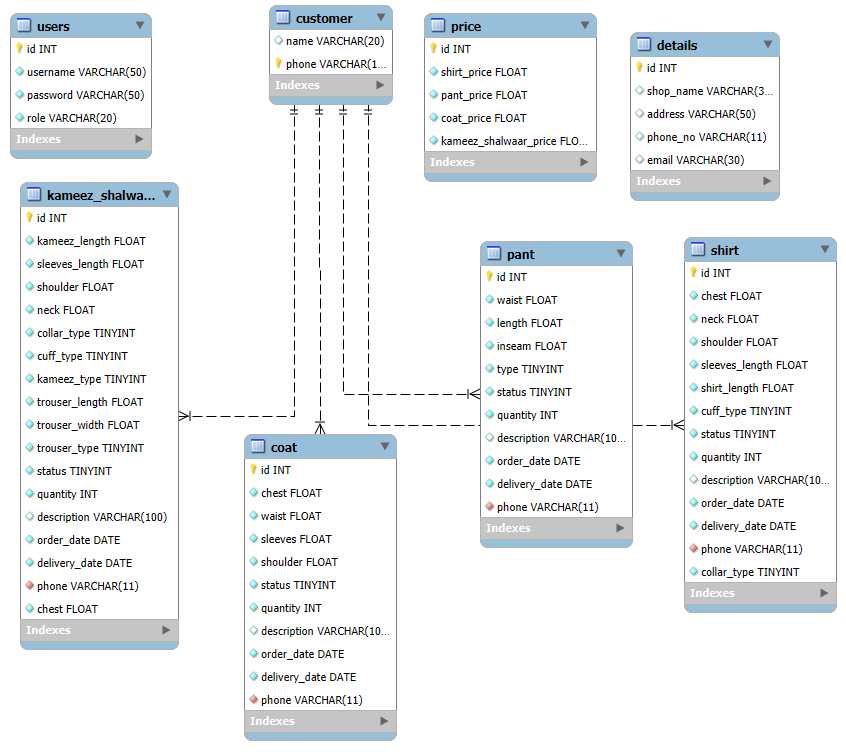

# Tailor-Management-System

# Database Design

# Queries are required

```sql
CREATE TABLE users(
id INT AUTO_INCREMENT PRIMARY KEY,
username VARCHAR(50) NOT NULL,
password VARCHAR(50) NOT NULL
);
```
```sql
CREATE TABLE details (
id INT NOT NULL AUTO_INCREMENT PRIMARY KEY,
shop_name VARCHAR(30),
address VARCHAR(50),
phone_no VARCHAR(11),
email VARCHAR(30)
);
```
```sql
create table customer(
    name VARCHAR(20),
    phone VARCHAR(11) PRIMARY KEY
);
```
```sql
create table pant(
    id INT AUTO_INCREMENT PRIMARY KEY ,
    waist FLOAT NOT NULL ,
    length FLOAT NOT NULL ,
    inseam FLOAT NOT NULL ,
    type TINYINT NOT NULL ,
    status TINYINT NOT NULL ,
    quantity INT NOT NULL ,
    description VARCHAR(100),
    order_date DATE NOT NULL ,
    delivery_date DATE NOT NULL ,
    phone VARCHAR(11) NOT NULL ,
    FOREIGN KEY (phone) REFERENCES customer(phone)
);
```
```sql
CREATE TABLE coat(
    id INT AUTO_INCREMENT PRIMARY KEY ,
    chest FLOAT NOT NULL ,
    waist FLOAT NOT NULL,
    sleeves FLOAT NOT NULL,
    shoulder FLOAT NOT NULL,
    status tinyint not null,
    quantity INT NOT NULL,
    description VARCHAR(100),
    order_date DATE NOT NULL,
    delivery_date DATE NOT NULL,
    phone VARCHAR(11) NOT NULL,
    FOREIGN KEY (phone) REFERENCES customer(phone)
);
```
```sql
CREATE TABLE shirt(
    id INT AUTO_INCREMENT PRIMARY KEY ,
    chest FLOAT NOT NULL,
    neck FLOAT NOT NULL,
    waist FLOAT NOT NULL,
    shoulder FLOAT NOT NULL,
    sleeves_length FLOAT NOT NULL,
    shirt_length FLOAT NOT NULL,
    cuff_type TINYINT NOT NULL,
    status TINYINT NOT NULL,
    quantity INT NOT NULL,
    description VARCHAR(100),
    order_date DATE NOT NULL,
    delivery_date date NOT NULL,
    phone VARCHAR(11) NOT NULL,
    FOREIGN KEY (phone) REFERENCES customer(phone)
);
```
```sql
CREATE TABLE kameez_shalwaar(
    id INT AUTO_INCREMENT PRIMARY KEY ,
    kameez_length FLOAT  NOT NULL,
    sleeves_length FLOAT  NOT NULL,
    shoulder FLOAT  NOT NULL,
    neck FLOAT  NOT NULL,
    collar_type TINYINT  NOT NULL,
    cuff_type TINYINT  NOT NULL,
    kameez_type TINYINT  NOT NULL,
    trouser_length FLOAT  NOT NULL,
    trouser_width FLOAT  NOT NULL,
    trouser_type TINYINT  NOT NULL,
    status TINYINT NOT NULL,
    quantity INT NOT NULL,
    description varchar(100),
    order_date DATE NOT NULL,
    delivery_date DATE NOT NULL,
    phone VARCHAR(11) NOT NULL,
    FOREIGN KEY (phone) REFERENCES customer(phone)
);
```